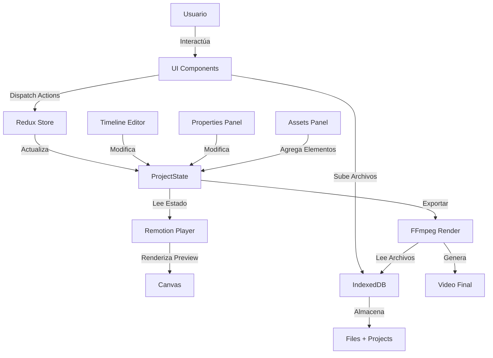

# Resumen de Arquitectura - Clip-JS

## 📋 Descripción General

**Clip-JS** es un editor de video online construido con **Next.js 14**, que utiliza **Remotion** para la previsualización en tiempo real y **FFmpeg (WebAssembly)** para el renderizado de alta calidad. Todo el procesamiento se realiza en el navegador del cliente, sin necesidad de subir archivos a servidores externos.

### Características Principales
- ✅ Previsualización en tiempo real
- ✅ Renderizado con FFmpeg (hasta 1080p)
- ✅ Editor de timeline interactivo
- ✅ Soporte para video, audio, imágenes y texto
- ✅ Control de propiedades (posición, opacidad, volumen, z-index)
- ✅ Atajos de teclado
- ✅ Sin marcas de agua, sin registro, sin anuncios

---

## 🏗️ Arquitectura del Proyecto

### Stack Tecnológico

```
Frontend Framework: Next.js 14 (App Router)
Preview Engine: Remotion (@remotion/player)
Render Engine: FFmpeg.wasm (@ffmpeg/ffmpeg)
State Management: Redux Toolkit (@reduxjs/toolkit)
Storage: IndexedDB (idb)
UI Libraries: 
  - TailwindCSS (estilos)
  - react-moveable (manipulación de elementos)
  - lucide-react (iconos)
  - react-hot-toast (notificaciones)
```

---

## 📁 Estructura de Directorios

```
clip-js/
├── app/
│   ├── (pages)/                    # Rutas de la aplicación
│   │   ├── about/                  # Página "Acerca de"
│   │   └── projects/               # Gestión de proyectos
│   ├── components/
│   │   ├── editor/                 # Componentes principales del editor
│   │   │   ├── AssetsPanel/        # Panel de recursos (media, texto, etc.)
│   │   │   ├── PropertiesSection/  # Panel de propiedades de elementos
│   │   │   ├── player/             # Reproductor de video (Remotion)
│   │   │   ├── render/             # Sistema de renderizado (FFmpeg)
│   │   │   ├── timeline/           # Editor de timeline
│   │   │   └── keys/               # Manejo de atajos de teclado
│   │   ├── header/                 # Cabecera de la app
│   │   └── footer/                 # Pie de página
│   ├── store/                      # Estado global (Redux)
│   │   ├── index.ts                # Configuración del store + IndexedDB
│   │   └── slices/
│   │       ├── projectSlice.ts     # Estado del proyecto actual
│   │       └── projectsSlice.ts    # Lista de proyectos
│   ├── types/
│   │   └── index.ts                # Definiciones TypeScript
│   ├── utils/                      # Utilidades
│   │   ├── data.ts                 # Datos estáticos (features)
│   │   ├── extractConfigs.ts       # Configuraciones de exportación
│   │   ├── extractThumbnail.ts     # Generación de miniaturas
│   │   └── utils.ts                # Funciones auxiliares
│   ├── Home.tsx                    # Página de inicio
│   ├── layout.tsx                  # Layout principal
│   └── page.tsx                    # Punto de entrada
├── public/                         # Archivos estáticos
├── package.json
└── next.config.js
```

---

## 🔄 Flujo de Datos y Componentes

### 1. **Gestión de Estado (Redux Store)**

El estado global se maneja con **Redux Toolkit** y se persiste en **IndexedDB**.

#### `store/index.ts`
- **Configuración del Store**: Combina los reducers de `projectState` y `projects`
- **IndexedDB Setup**: Crea dos object stores:
  - `files`: Almacena archivos multimedia (File objects)
  - `projects`: Almacena proyectos completos (metadata + referencias a archivos)
- **Funciones de almacenamiento**:
  - `storeFile()`, `getFile()`, `deleteFile()`, `listFiles()`
  - `storeProject()`, `getProject()`, `deleteProject()`, `listProjects()`

#### `store/slices/projectSlice.ts`
Define el estado del proyecto actual:

```typescript
ProjectState {
  id: string
  projectName: string
  createdAt: string
  lastModified: string
  
  // Elementos del proyecto
  mediaFiles: MediaFile[]        // Videos, audios, imágenes
  textElements: TextElement[]    // Elementos de texto
  filesID: string[]              // IDs de archivos en IndexedDB
  
  // Reproducción
  currentTime: number
  isPlaying: boolean
  isMuted: boolean
  duration: number
  
  // UI
  timelineZoom: number
  enableMarkerTracking: boolean
  activeSection: 'media' | 'text' | 'export'
  activeElement: ActiveElement | null
  activeElementIndex: number
  
  // Configuración de video
  resolution: { width: number, height: number }
  fps: number
  aspectRatio: string
  
  // Exportación
  exportSettings: ExportConfig
  
  // Historial (undo/redo)
  history: ProjectState[]
  future: ProjectState[]
}
```

**Acciones principales**:
- `setMediaFiles()`, `setTextElements()`
- `setCurrentTime()`, `setIsPlaying()`, `setIsMuted()`
- `setActiveElement()`, `setActiveElementIndex()`
- `setExportSettings()`, `setResolution()`, `setFps()`
- `rehydrate()` - Restaurar proyecto desde IndexedDB
- `createNewProject()` - Resetear al estado inicial

---

### 2. **Tipos de Datos (`types/index.ts`)**

#### MediaFile
```typescript
{
  id: string
  fileName: string
  fileId: string              // Referencia a IndexedDB
  type: 'video' | 'audio' | 'image'
  
  // Timing en el archivo original
  startTime: number
  endTime: number
  
  // Posición en el timeline final
  positionStart: number
  positionEnd: number
  
  // Propiedades
  includeInMerge: boolean
  playbackSpeed: number
  volume: number
  zIndex: number
  
  // Transformaciones visuales
  x, y, width, height: number
  rotation: number
  opacity: number
  crop: { x, y, width, height }
}
```

#### TextElement
```typescript
{
  id: string
  text: string
  
  // Timing
  positionStart: number
  positionEnd: number
  
  // Posición y tamaño
  x, y, width, height: number
  
  // Estilo
  font: string
  fontSize: number
  color: string
  backgroundColor: string
  align: 'left' | 'center' | 'right'
  zIndex: number
  
  // Efectos
  opacity: number
  rotation: number
  fadeInDuration: number
  fadeOutDuration: number
  animation: 'slide-in' | 'zoom' | 'bounce' | 'none'
}
```

---

### 3. **Sistema de Previsualización (Remotion)**

#### `components/editor/player/remotion/Player.tsx`
- **Componente**: `<PreviewPlayer />`
- **Función**: Renderiza el reproductor de Remotion
- **Sincronización**:
  - Escucha cambios en `currentTime` del store → actualiza frame del player
  - Escucha eventos `play`/`pause` del player → actualiza `isPlaying` en store
  - Controla mute/unmute según `isMuted`

#### `components/editor/player/remotion/sequence/composition.tsx`
- **Componente**: `<Composition />`
- **Función**: Composición principal de Remotion
- **Renderizado**:
  - Itera sobre `mediaFiles` y renderiza cada elemento según su tipo
  - Itera sobre `textElements` y renderiza textos
  - Usa `SequenceItem[type]` para renderizar cada elemento

#### `components/editor/player/remotion/sequence/sequence-item.tsx`
- Mapea tipos de elementos a componentes de Remotion
- Maneja la lógica de `<Sequence>` para timing correcto

---

### 4. **Sistema de Renderizado (FFmpeg)**

#### `components/editor/render/Ffmpeg/FfmpegRender.tsx`
- **Componente principal de renderizado**
- **Proceso**:
  1. Carga FFmpeg.wasm
  2. Extrae configuraciones de exportación (`extractConfigs.ts`)
  3. Escribe archivos en el sistema virtual de FFmpeg
  4. Construye comando FFmpeg con filtros complejos
  5. Ejecuta renderizado con progreso en tiempo real
  6. Descarga el video resultante

#### `utils/extractConfigs.ts`
- Convierte configuraciones de usuario a parámetros FFmpeg
- Mapea resoluciones (1080p, 720p, etc.) a dimensiones
- Define presets de calidad y velocidad

---

### 5. **Editor de Timeline**

#### `components/editor/timeline/`
- **Timeline.tsx**: Componente principal del timeline
- **Header.tsx**: Controles de zoom, marcadores
- Permite:
  - Arrastrar elementos para reposicionar
  - Redimensionar duración
  - Split (dividir) elementos
  - Duplicar elementos
  - Eliminar elementos

---

### 6. **Panel de Propiedades**

#### `components/editor/PropertiesSection/`
- **MediaProperties.tsx**: Propiedades de video/audio/imagen
  - Volumen, opacidad, z-index, posición
- **TextProperties.tsx**: Propiedades de texto
  - Fuente, tamaño, color, alineación, animaciones
- **MoveableElement.tsx**: Integración con `react-moveable`
  - Permite arrastrar, redimensionar, rotar elementos en el canvas

---

### 7. **Panel de Recursos (Assets)**

#### `components/editor/AssetsPanel/`
- **AddButtons**: Botones para agregar media/texto
- **SidebarButtons**: Navegación entre secciones (media, texto, export)
- **tools-section**: Herramientas adicionales

---

### 8. **Gestión de Proyectos**

#### `app/(pages)/projects/`
- Lista de proyectos guardados en IndexedDB
- Crear nuevo proyecto
- Cargar proyecto existente
- Eliminar proyectos

---

## 🔗 Flujo de Conexión entre Componentes



### Flujo Detallado

1. **Carga de Archivos**:
   - Usuario sube archivo → `storeFile()` → IndexedDB
   - Se crea `MediaFile` con `fileId` → `setMediaFiles()` → Redux

2. **Edición en Timeline**:
   - Usuario arrastra elemento → Timeline actualiza `positionStart/End`
   - Dispatch `setMediaFiles()` con array actualizado

3. **Previsualización**:
   - Redux state cambia → `<PreviewPlayer>` detecta cambio
   - Remotion re-renderiza `<Composition>`
   - `<Composition>` itera elementos y renderiza según timing

4. **Renderizado Final**:
   - Usuario hace clic en "Export" → `<FfmpegRender>`
   - Lee archivos de IndexedDB con `getFile()`
   - Construye comando FFmpeg con filtros
   - Ejecuta renderizado → Descarga video

5. **Persistencia**:
   - Cambios en proyecto → `storeProject()` → IndexedDB
   - Al cargar app → `listProjects()` → Muestra proyectos guardados

---

## 🎯 Puntos Clave de Modificación

Si necesitas modificar el proyecto, estos son los puntos de entrada:

### Agregar nuevo tipo de elemento
1. Definir tipo en `types/index.ts`
2. Agregar reducer en `projectSlice.ts`
3. Crear componente de Remotion en `sequence/items/`
4. Agregar a `SequenceItem` mapping

### Modificar renderizado
- `FfmpegRender.tsx` → Lógica de FFmpeg
- `extractConfigs.ts` → Configuraciones de exportación

### Cambiar UI del editor
- `timeline/` → Editor de timeline
- `PropertiesSection/` → Panel de propiedades
- `AssetsPanel/` → Panel de recursos

### Agregar efectos/filtros
- Agregar propiedades a tipos en `types/index.ts`
- Implementar en componentes de Remotion
- Agregar filtros FFmpeg en `FfmpegRender.tsx`

---

## 📝 TODOs Pendientes (del proyecto original)

### Completados ✅
- Renderizado con FFmpeg
- Zoom en timeline
- Duplicar/split elementos
- Atajos de teclado (espacio, mute, s, d, del)
- Docker containerization

### Pendientes ❌
- Proyecto demo por defecto
- Drag del playhead marker
- Exportar/importar proyectos
- Separar audio de videos
- Velocidad de reproducción
- Responsive para móviles
- Más efectos de texto
- Modo PWA (edición offline)
- Miniaturas para videos/imágenes
- Aceleración GPU (WebGL/WebGPU)

---

## 🚀 Comandos de Desarrollo

```bash
# Instalar dependencias
npm install

# Desarrollo
npm run dev

# Build producción
npm run build
npm start

# Docker
docker build -t clipjs .
docker run -p 3000:3000 clipjs
```

---

## 📦 Dependencias Clave

| Paquete | Propósito |
|---------|-----------|
| `@remotion/player` | Previsualización en tiempo real |
| `@ffmpeg/ffmpeg` | Renderizado de video |
| `@reduxjs/toolkit` | Gestión de estado |
| `idb` | Almacenamiento IndexedDB |
| `react-moveable` | Manipulación de elementos |
| `next-themes` | Soporte de temas |
| `react-hot-toast` | Notificaciones |

---

## 🎨 Arquitectura de Datos

```
IndexedDB: clipjs-files
├── Object Store: files
│   └── { id, file: File }
└── Object Store: projects
    └── { 
        id, 
        projectName, 
        createdAt, 
        lastModified,
        mediaFiles: [...],
        textElements: [...],
        filesID: [...],
        exportSettings: {...}
    }
```

---

## 🔧 Consideraciones Técnicas

1. **Todo en el Cliente**: No hay backend, todo se procesa en el navegador
2. **Limitaciones de Memoria**: IndexedDB tiene límites según el navegador
3. **Performance**: FFmpeg.wasm es más lento que FFmpeg nativo
4. **Compatibilidad**: Requiere navegadores modernos con soporte para WebAssembly
5. **Archivos Grandes**: Pueden causar problemas de memoria en navegadores

---

Este documento proporciona una visión completa de la arquitectura de **Clip-JS**. Para modificaciones específicas, consulta los archivos mencionados en cada sección.
